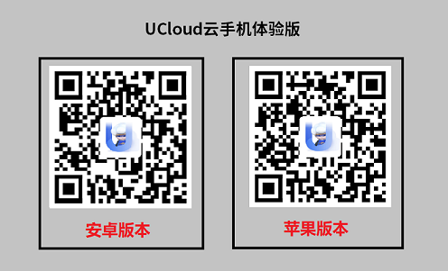

# 云手游2C场景

### 基础体验
咨询销售和产品经理，体验1部云手机的延迟、画质
* 

# 完整测试
1. 游戏镜像：可基于UCloud标准安卓镜像上传游戏apk制作，也可使用UCloud已制作的公共游戏镜像
2. 兼容性测试：UCloud已测试170余款游戏，客户可提供待测游戏列表给UCloud完成导入测试
3. 二次开发接入：根据UCloud提供的云游戏API和SDK，服务器整机进行二次开发适配
4. 预约服务器：由于供货周期在2-3月，需要提前预约来缩短上线周期

# 业务上线
批量购买服务器，调用API创建云游戏实例，UCloud调度平台从客户资源池提供实例

# 持续运营
通过Web控制台设置调度参数，维护资源池的余量、游戏优先级；可查看服务器的监控负载，接入资源告警
