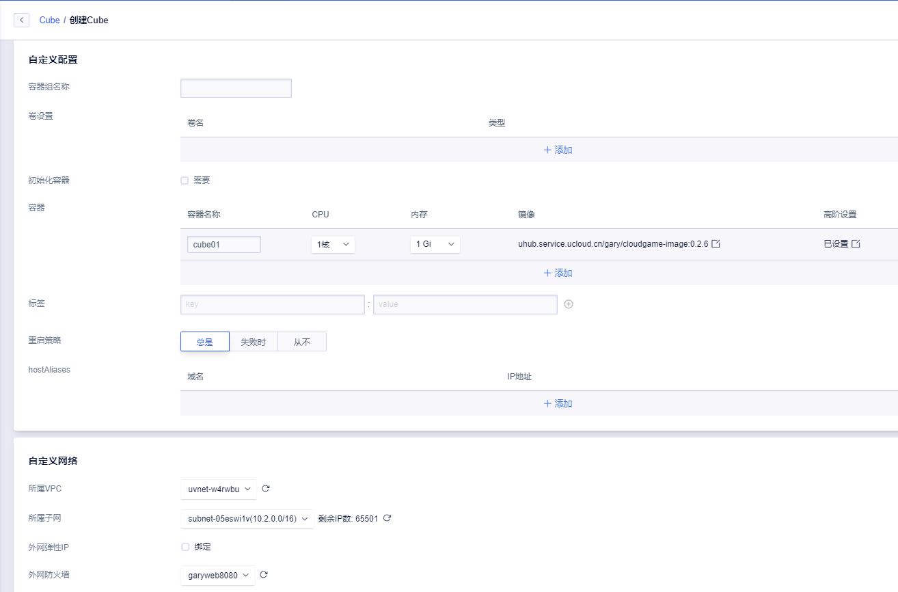
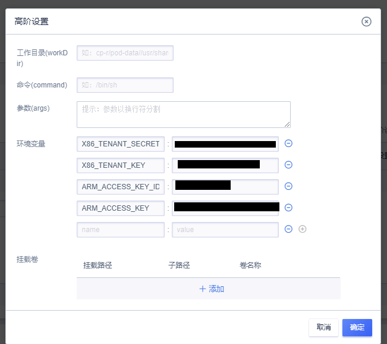
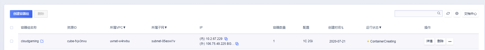
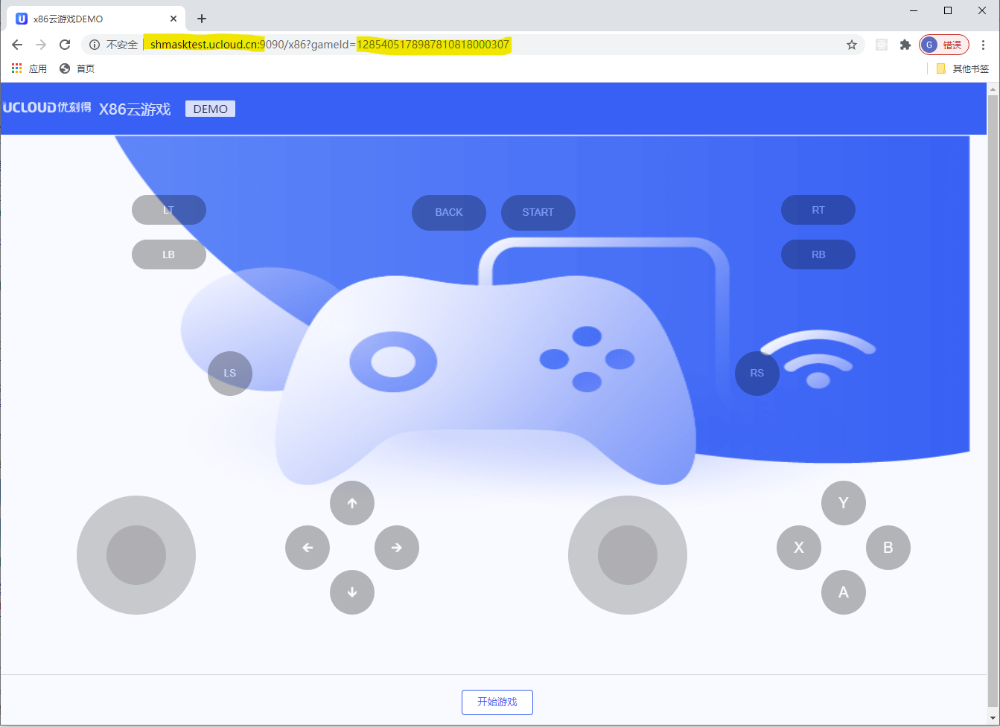

# 云游戏WEB演示程序快速上手指南
为了您更好的使用云游戏服务，缩短开发周期，我们也准备了一个Docker镜象来供您对云游戏进行试用和联调测试，同时在您完成了云游戏服务创建后，我们也提供了几款游戏供您进行客户端同步开发和内部测试。需要特别说明的是，您不得将这些测试进行商业运营，除非您正式的获得了这些游戏的版权。

### 环境准备
在开始之前，请您先确认以下几点:
1. 您已经通过控制台完成了云游戏产品的权限申请，同时在控制台上已经购买了X86/ARM实例，并已经完成了游戏的上传和适配工作。如果您使用的是x86的云游戏，则请您确认已经在上海区域创建了并发数不少于1的实例。
1. 获取帐号和游戏对应信息，X86云游戏必须的信息为 accessKey/accessKeyId/gameId； ARM云游戏所需要的信息为tenantKey/TenantSecret/bundleId。您可以根据自己的需求来获取。
1. 由于镜象使用的端口为TCP 8080，如果需要使用EIP直接访问镜像，请先在 基础网络-> 外网防火墙TAB 创建外网防火墙，放通8080端口。如果您对ULB或者NATGW非常熟悉，也可以使用其他方式来访问Servless的IP/端口。

### 创建Servless服务
1. 申请相应的cube，填入以下信息
CPU 选择0.5 core/内存选择2G 
在镜象里选择 Cube-lab cloudgame-dem

高级设置里传入相应的环境变量
- ARM_ACCESS_KEY_ID
- ARM_ACCESS_KEY
- X86_TENANT_SECRET
- X86_TENANT_KEY
- 变量的值
	
根据自己的需要来勾选外网弹性IP。 用户在使用云游戏时，主要的资源消耗在云游戏实例中，因此这里并不需要很高的带宽。所以如果勾选，带宽可以选择最小的1M。
2. 防火墙选择为您刚才创建的放通8080端口的防火墙
3. 静等几秒之后，容器实例的状态变成了running状态，然后就可以通过cube 对应的 EIP来使用云游戏演示程序了。

### 通过WEB访问DEMO页面
- ARM云游戏使用方式为： http://yourip:8080/arm?game=com.xxx.xxx
- X86云游戏使用方式为: http://yourip:8080/x86?gameId=12345678 

如果你的设置全部正确，您就可以在浏览器上看到上面的界面，可以享受一下即点即玩的云游戏服务了。接下来要做的，就是将SDK集成到您自己的应用中去，让您的最终用户尽情享受云游戏带来的乐趣了。 
