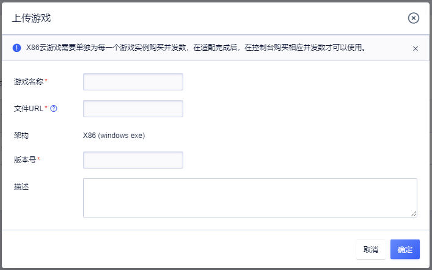
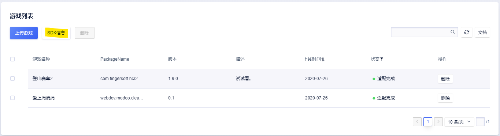
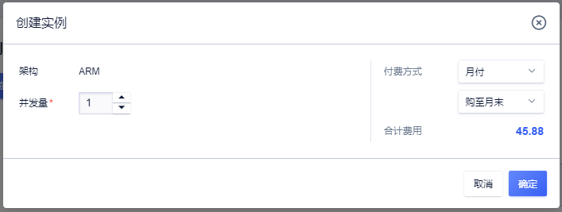

# UCloud云游戏服务操作指南

## X86游戏上线
### 1. 游戏上传
1. 首先要特别说明的是，如果您计划商业运营云游戏平台，您必须要取得您上传的游戏的版权。
1. 在您已经开通了UCGS产品权限后，首先要做的是将需要在云端运行的游戏的安装包上传至云游戏平台。由于通常游戏的安装包都比较大，小则几百M上则数G，因此建议您通过上传工具将相应的安装包上传至对应的WEB服务器，并计算checksum之后再将相应的信息在我们Console上录入。

1. 在游戏上传之后，您可能需要耐心等待一段时间，等游戏完成相应的上架任务。如果您上传的是x86的游戏，并且该款游戏是首次在平台中上传，我们可能需要10工作日左右对该款游戏运行所需要的资源量进行评估。
1. 如果在评估和上架过程中出现问题，我们的工作人员可能会主动联系您，并和您确认相应的后续安排。
### 2. 实例开通
1. ARM游戏上架成功之后，如果您已经创建了ARM实例，您可以在自己的应用中将相应的bundleID改成上架模式即可使用。
1. 在X86游戏上传成功之后，经过系统的验证后，游戏的状态会变成适配成功状态。这时您需要在相应的地域开通游戏实例，并支付相应的产品费用。建议您根据自己的用户在北京，上海，广州分布情况来分别购买不同的并发和创建游戏实例。如果您第一次上线，建议您每个地域购买1-2个并发进行测试后再批量购买。如果您需要创建的实例数超过了系统的配额，请您先和我们的工作人员联系。
1. 一般创建游戏实例需要1工作日左右。如果您的游戏实例状态变成了运行中，则可以通过SDK进行调用。
### 3. 游戏测试
1. 在您的实例在运行状态后，即可以通过相应的SDK来在自己的应用中集成云游戏服务了。要特别注意的是，ARM云游戏和x86云游戏对应的SDK/Key/Secret是不同的，对应的参数也是不同的。您如果需要同时使用x86云游戏和ARM 云游戏服务的话，目前开发需要区分。
1. 在控制台的云游戏->x86 TAB的SDK信息按钮中，您可以获取到相应的TenantKey/TenantID信息以及相应的节点ID信息。这些信息您在开发您自己的APP或者WEB应用时将会用到。

1. 获取自己游戏的GameId，以上这些信息您在将云游戏服务集成到自己的应用中时，都会使用到。
1. 在完成自己的应用和云游戏服务的集成和测试。

### 4. 游戏上线
在您验证SDK已经可以正常的在您的程序/网站运行后，就可以正式上线了。这时您需要根据您业务的需求在我们的控制台购买与您业务量匹配的游戏并发数量。如果您一次需要的并发数量已经超过了控制台的配额，请您直接联系您的客服经理请求支持。

## ARM游戏上线
### 1. 游戏上架
1. 首先要特别说明的是，如果您计划商业运营云游戏平台，您必须要取得您上传的游戏的版权。
1. 在您已经开通了UCGS产品权限后，首先要做的是将需要在云端运行的游戏的安装包上传至云游戏平台。由于通常游戏的安装包都比较大，小则几百M上则数G，因此建议您通过上传工具将相应的安装包上传至对应的WEB服务器，并计算checksum之后再将相应的信息在我们Console上录入。

1. 稍等几分钟后，游戏的状态变成适配完成之后，即意味着上架成功。如果你已经购买了并发量，就可以直接使用SDk进行测试了。

### 2. 实例购买/调整
ARM游戏的并发数是不区分游戏，也不区分地域。您只需要在第一款游戏上架时已经购买了相应的并发量，那么这一步可以按需进行。

### 3. 游戏测试与上线
在游戏上架成功后，您就可以通过自己程序调用游戏SDK进行测试了。
 在控制台的云游戏->ARM TAB的SDK信息按钮中，您可以获取到相应的AccessKey/AccessKeyID信息。这些信息您在开发您自己的APP或者WEB应用时将会用到。

## SDK获取
为了方便您的开发，我们提供了IOS/Android以及Web SDK以及相应的文档和DEMO，请您线下向相应的服务经理申请。